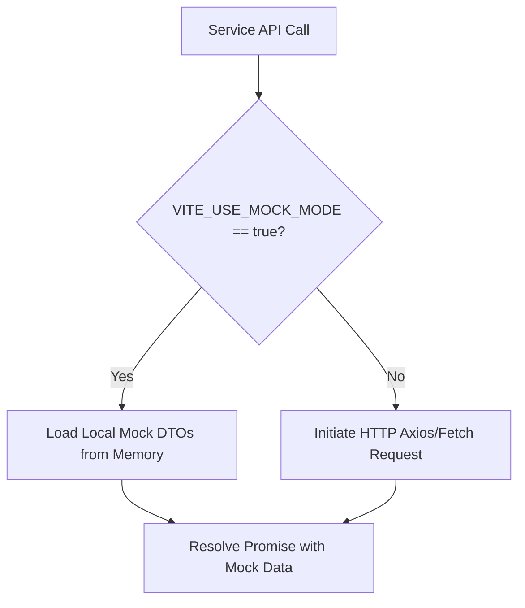

# Frontend Service-Layer Mocking Strategy

This document details the Client-Side Mock Mode strategy used to isolate frontend testing, speed up local development, and prevent pipeline blocks.

---

## 1. Overview & Rationale

During development or automated E2E testing, backend components (such as Keycloak authentication, PostgreSQL databases, or LLM services) might be unmerged or offline. If the frontend makes network calls to unreachable servers during standard CI build checks, Playwright tests deadlock and fail.

To resolve this, we implement a service-layer Client-Side Mock Mode driven by the environment variable:
`VITE_USE_MOCK_MODE=true`

---

## 2. Mock Interception Flow

Each API service (e.g. `chatService`, `userService`, `knowledgeService`) checks the environment flag before initiating any external network fetches.



### Example Implementation (`chatService.ts`)
```typescript
import { mockConversations } from "../mocks/chatMocks";

export async function fetchChatHistory(chatId: string): Promise<MessageDto[]> {
    // Intercept call if mock mode is active
    if (import.meta.env.VITE_USE_MOCK_MODE === "true") {
        return mockConversations[chatId] || [];
    }
    
    // Standard backend fetch
    const response = await axios.get(`/api/v1/chats/${chatId}`);
    return response.data;
}
```

---

## 3. Playwright E2E & A11y Verification

In the continuous integration pipeline, E2E tests are executed with the mock flag active:

1. **Vite Start**: The test script launches the Vite dev server with:
   `cross-env VITE_USE_MOCK_MODE=true vite`
2. **Playwright Execution**: Playwright opens the local browser pointing to Port 5173.
3. **Decoupled Operation**: Since mock mode handles all authentication states (mocking user profiles and token lifecycles), the browser navigates from the onboarding wizard to the dashboard instantly without needing a running Keycloak server.
4. **Resiliency**: Ax-core accessibility testing evaluates the DOM without waiting for asynchronous network fetches, reducing flakes and preventing deadlocks.
